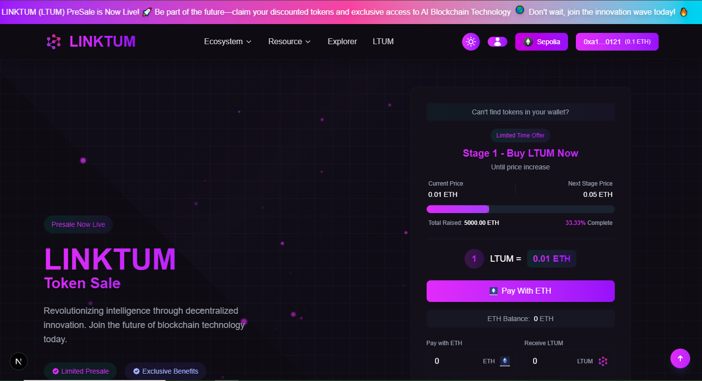

ICO PreSale (ERC20 Token) DApp
Build & Deploy ICO PreSale (ERC20 Token) DApp | Solidity + Next.js | Binance, Polygon, Ethereum

In this project, you'll learn how to build and deploy a full-stack ICO PreSale DApp from scratch using Solidity, Next.js, and Web3 tools. We'll create an ERC20 token, build a presale smart contract, and deploy it on Binance Smart Chain (BSC), Polygon, and Ethereum. The frontend will be developed in Next.js and integrated using wagmi, web3.js, and Web3 Provider to connect user wallets like MetaMask.

💡 What You’ll Learn:

How to create an ERC20 token in Solidity
How to build an ICO PreSale smart contract
Deploy smart contracts to BSC, Polygon, and Ethereum
Integrate smart contracts with a frontend using Next.js
Use wagmi and web3.js for Web3 wallet integration
Connect MetaMask and manage user interaction
🚀 Tech Stack:

# ERC20 Token Standard
Solidity Smart Contracts
Next.js Frontend Framework
web3.js & wagmi for Web3 functionality
Web3 Provider for wallet connections
📦 Tags: erc20 token, nextjs solidity, web3.js, wagmi, ICO presale DApp, BSC token sale, polygon crypto, ethereum dapp, deploy ICO, smart contract

# Project Overview

Instruction
Kindly follow the following Instructions to run the project in your system and install the necessary requirements

Final Source Code
Setup Video
Final Code Setup video
Deploying Dapp
  WATCH: Hostinger
  Get : 
  URL: 
MULTI-CURRENCY ICO DAPP
  PROJECT: MULTI-CURRENCY ICO DAPP
  Code: 
  VIDEO:
Install Vs Code Editor
  GET: VsCode Editor
  URL: https://code.visualstudio.com/download
NodeJs & NPM Version
  NodeJs: v18.17.1 / LATEST
  NPM: 8.19.2
  URL: 
  Video: https://youtu.be/PIR0oBVowXU?si=9eNdR29u37F2ujJJ

All you need to follow the complete project and follow the instructions which are explained in the tutorial by Jamil

Final Code Instruction
If you download the final source code then you can follow the following instructions to run the Dapp successfully

🐛 Troubleshooting
Common Issues

Balance not showing

Ensure showBalance={true} in RainbowKitProvider
Check if WalletConnect Project ID is set
Try refreshing the page after connecting

Account switching not working

The app includes AccountWatcher component
Account changes trigger automatic page reload
Check browser console for debug logs

RPC Errors

Use your own Alchemy/Infura API keys
Check network connection
Try switching to different RPC endpoints

Debug Mode
Enable debug logs by checking the browser console. The app logs:

Wallet connection status
Balance fetch attempts
Account changes
RPC calls

🔍 Debug Components
The project includes debug components for development:
javascriptimport DebugBalance from './components/DebugBalance';

// Shows detailed wallet and balance information
<DebugBalance />
📝 Environment Variables
VariableDescriptionRequiredNEXT_PUBLIC_WALLET_CONNECT_PROJECT_IDWalletConnect Project IDYesNEXT_PUBLIC_ALCHEMY_API_KEYAlchemy RPC API KeyNoNEXT_PUBLIC_INFURA_API_KEYInfura RPC API KeyNo
Deployment
Vercel (Recommended)

Push your code to GitHub
Connect your repository to Vercel
Add environment variables in Vercel dashboard
Deploy automatically

Manual Deployment
bashnpm run build
npm start
🤝Contributing

Fork the repository
Create your feature branch (git checkout -b feature/amazing-feature)
Commit your changes (git commit -m 'Add some amazing feature')
Push to the branch (git push origin feature/amazing-feature)
Open a Pull Request

📄 License
This project is licensed under the MIT License - see the LICENSE file for details.
Acknowledgments

RainbowKit - Beautiful wallet connection UI
Wagmi - React hooks for Ethereum
Viem - TypeScript interface for Ethereum
Next.js - React framework
Tailwind CSS - Utility-first CSS framework

📞 Support
If you have any questions or issues:

Check the troubleshooting section
Open an issue on GitHub
Check the browser console for error messages
Ensure all environment variables are set correctly

Made with ❤️ for the Web3 community